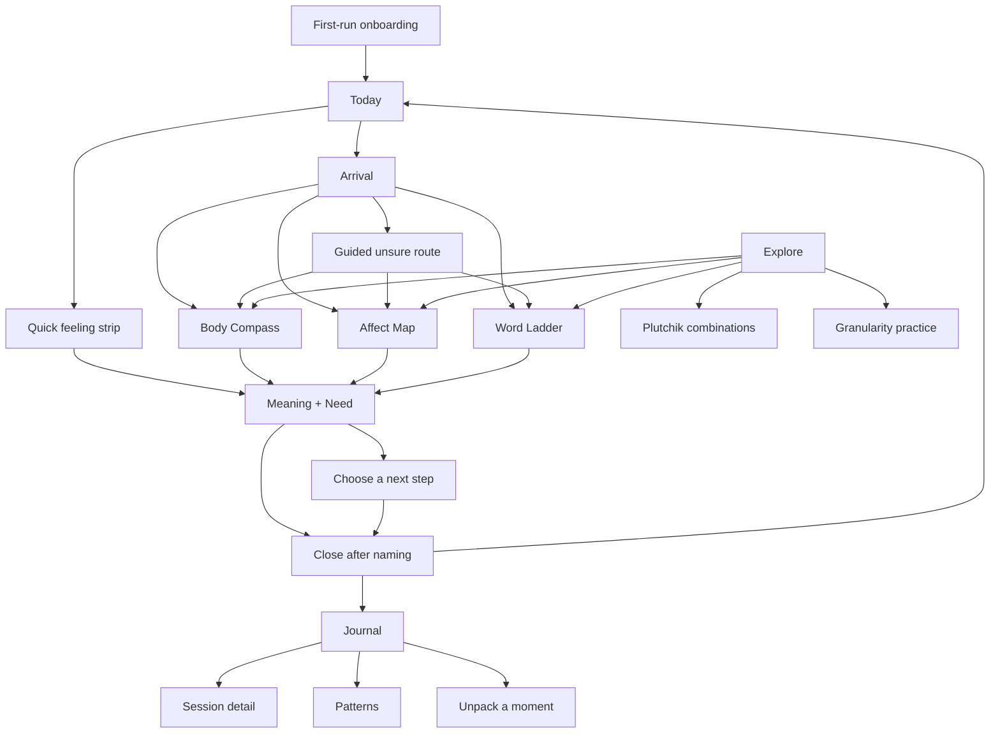

# Mobile Rehaul Implementation Plan

Status: implemented July 22, 2026. Verified by `npm run check` and 34 repeatable
Playwright cases across Mobile Safari and Mobile Chrome.

Target: move the current model-first mobile UI to the approved Daily Thread shell,
Arrival entry, capability-based check-in routes, and Meaning + Need reflection.

Planning basis:

- Current code and tests, July 22, 2026.
- `ANALYSIS.md` sections 9.1-9.5.
- `docs/mobile-rehaul-review.md`.
- `docs/mobile-rehaul-mocks.html`.

The rehaul is an information-architecture and interaction refactor. The emotion catalog,
model analyzers, local persistence, temporal crisis escalation, tier gating, and most
domain logic remain the source of truth.

## Product Decision

Recommended composition:

- **Shell:** Daily Thread.
- **Default entry:** Arrival.
- **Routes:** Body Compass, Affect Map, Word Ladder.
- **Reflection:** Meaning + Need.
- **Named models:** Explore, not primary navigation.
- **History:** Journal, not Settings.

The user chooses how they can access the experience now, not which psychological theory
they understand.

## Target Information Architecture



Persistent bottom navigation:

1. **Today:** start or continue a check-in.
2. **Explore:** choose a method, learn a model, or practice vocabulary.
3. **Journal:** review locally saved reflections and patterns.

Settings remains a utility destination from the top-right icon. Support remains reachable
from Today, Reflection, Settings, and every crisis state.

## Screen Inventory

### Essential screens for the first release

| Screen | Purpose | Current source to reuse | Build status |
| --- | --- | --- | --- |
| First-run onboarding | Set expectations, privacy, language, and optional local saving | `Onboarding.tsx` | Replace model-choice final step |
| Today | Calm home, quick strip, recent thread, start button | `QuickCheckIn.tsx`, session repo | New |
| Arrival | Choose words, body, placement, or guided uncertainty | `DontKnowModal.tsx` | New full screen |
| Body Compass | Region -> sensation -> intensity -> possible words | `BodyMap.tsx`, pickers, `GuidedScan.tsx` | Recompose |
| Affect Map | Place a point, read dimensions, then reveal suggestions | `DimensionalField.tsx` | Recompose |
| Word Ladder | Broad family -> branch -> precise word | Wheel model, `WheelBreadcrumb.tsx` | New presentation |
| Meaning + Need | Tentative synthesis, fit check, function, need | `ResultModal.tsx`, `ResultsView.tsx` | Recompose as screen |
| Next Step | One need-aligned option, intervention, or stop | `MicroIntervention.tsx`, opposite action | Recompose |
| Explore | Capability cards and named-model education | Registry, current model bar | New |
| Model Workspace | Preserve advanced Wheel/Plutchik exploration | Current `App.tsx` visualization area | Extract/reuse |
| Journal | Recent sessions plus low-pressure pattern summaries | `SessionHistory.tsx`, panels | Recompose |
| Session Detail | Revisit one reflection and its chosen next step | Session data | New |
| Settings | Language, theme, sound, reminders, simple copy | `SettingsMenu.tsx` | Replace long sheet |
| Privacy & Data | Local saving, export, delete, external AI permission | `SettingsMenu.tsx`, export repo | New destination |
| Support | Crisis resources, scope, emergency guidance | Current crisis/settings copy | New destination |

### Secondary screens after the core flow is stable

| Screen | Purpose | Current source |
| --- | --- | --- |
| Patterns | Vocabulary breadth, valence balance, body patterns | `SessionHistoryPanels.tsx` |
| Practice Words | Granularity exercise outside Settings | `GranularityTraining.tsx` |
| Unpack a Moment | Chain analysis as a Journal tool | `ChainAnalysis.tsx` |
| Model Guide | Short, optional explanation of each framework | Registry metadata and onboarding copy |

### Steps and sheets, not standalone screens

- Sensation picker and intensity picker: Body Compass steps.
- Suggested words: Affect Map bottom sheet after placement.
- Compare nearby words: Word Ladder sheet or inline disclosure.
- More context: Meaning + Need disclosure.
- Save/discard choice: warm-close step.
- Confirm delete/export: portaled, focus-trapped dialogs.

Avoid separate screens for model selection during onboarding, scores, streaks, achievements,
or an authoritative-sounding "analysis" report.

## Mock-to-Code Gap Analysis

### 1. Arrival

**Existing assets**

- `QuickCheckIn` provides a low-friction emotion list.
- `DontKnowModal` already redirects users to somatic or dimensional models.
- `useModelSelection` and the registry can open all four engines.

**Gaps**

- Quick check-in is visually secondary and hidden behind a button.
- "I don't know" is framed as fallback/error recovery.
- Routes are model names, not user capabilities.
- Modal presentation stacks over the current model workspace.
- No single draft survives route changes.

**Refactor**

- Promote Arrival to a full screen.
- Offer `Use words`, `Start with my body`, `Place the feeling`, and `Guide me`.
- Keep route descriptions concrete and non-diagnostic.
- Let Back return to Today without losing existing saved sessions.

### 2. Body Compass

**Existing assets**

- Clickable front-body regions.
- Sensation and intensity data.
- Somatic scoring and context copy.
- Guided scan, including numbness/flooding safeguards.

**Gaps**

- Region, sensation, and intensity are split across visualization plus overlays.
- Current screen still behaves like a model canvas, not a guided path.
- Front/back body orientation is not a first-class step control.
- Selected region and progress are weakly summarized.
- Possible emotions appear as analysis rather than cautious suggestions.

**Refactor**

- One full-screen route with a visible 1-of-3 progression.
- Stable body viewport; front/back segmented control; one focused region at a time.
- Sensation and intensity remain user-reported inputs.
- Generate possible words only after input, preserving probabilistic language.
- Retain `GuidedScan` as optional help, not the default overlay.

### 3. Affect Map

**Existing assets**

- Valence/arousal coordinates and nearest-emotion calculation.
- Axis hints, placement, and suggestion tray.
- Mobile collision work and 48px suggestion targets.

**Gaps**

- The current plot exposes many labels before the user places a point.
- Tiny labels and dots anchor choice and increase visual search load.
- Crosshair placement reads as technical measurement.
- Suggestions and dimensional readout lack a strong sequence.

**Refactor**

- Begin with four plain-language axis anchors and an empty field.
- Use a large draggable target plus tap-to-place.
- Show a semantic readout first: energy and pleasantness, with uncertainty.
- Reveal 3-5 suggested words after placement in normal document flow or a sheet.
- Keep continuous coordinates and existing nearest-neighbor logic unchanged.

### 4. Word Ladder

**Existing assets**

- Wheel hierarchy, parent relationships, breadcrumb logic, and analysis.
- Comprehensive bilingual emotion catalog.
- Granularity triads for comparison practice.

**Gaps**

- Random-looking bubble placement implies meaning that the hierarchy does not encode.
- Several levels can be visible at once, increasing choice load.
- Breadcrumbs show location but not meaningful word distinctions.
- The current output jumps from selection to analysis.

**Refactor**

- Render one hierarchy level as a stable list or grid.
- Keep the selected path visible: family -> branch -> word.
- Offer 2-3 nearby words with one-line distinctions.
- Permit selection at any level; precision is optional, not mandatory.
- Use the current Wheel analyzer as the engine.

### 5. Meaning + Need

**Existing assets**

- Crisis tier evaluation and temporal escalation.
- Synthesis, adaptive framing, opposite action, intervention, fit question.
- Warm close and follow-up states.

**Gaps**

- Result content starts as dense educational cards.
- The fit question and action sit below long prose.
- "Analysis" implies objective certainty.
- Result is a modal stacked above the selection UI.
- Need and immediate agency are not the first visual hierarchy.

**Refactor**

- Route to a replacement screen; do not stack dialogs.
- Preserve crisis content as the first block whenever triggered.
- Then show: tentative synthesis -> fit -> adaptive function -> possible need.
- Offer `Try one small step`, `More context`, and `Done for now`.
- Keep detailed model output behind progressive disclosure.
- Save only after the warm-close state, using existing preference semantics.

### 6. Daily Thread

**Existing assets**

- Quick emotion catalog.
- IndexedDB session history.
- Vocabulary, valence, somatic, and progression summaries.
- Optional daily reminder.

**Gaps**

- No home destination or app-level navigation.
- History is a Settings action and then a modal.
- No single recent reflection or gentle continuity cue on entry.
- Existing analytics read as reports, not a personal thread.
- No distinction between daily action and deeper exploration.

**Refactor**

- Add Today/Explore/Journal shell.
- Today shows one primary start action, quick strip, and at most one recent thread.
- Journal owns history, export entry, and patterns.
- No streak, score, red badge, or guilt-producing missed-day state.

## Cross-Cutting Gaps

### Navigation and ownership

Current `App.tsx` owns model state plus ten modal/sheet booleans. The rehaul needs typed
destinations and route-local state. Each check-in screen should own its model interaction;
the app-level flow should own only navigation, completion, reflection, and persistence.

### Shared check-in contract

There is no route-neutral draft. Add a contract similar to:

```ts
type CheckInRoute = 'quick' | 'body' | 'affect' | 'words' | 'plutchik'

interface CheckInDraft {
  route: CheckInRoute
  modelId: string
  selections: BaseEmotion[]
  results: AnalysisResult[]
  startedAt: number
}
```

Route-specific detail remains in serialized selection extras. Do not invent a second emotion
catalog or duplicate model analysis in screen components.

### Session schema

Extend `Session` additively with optional fields:

```ts
entryRoute?: CheckInRoute
selectedNeedId?: string
nextStepId?: string
```

Keep existing `modelId`, selections, results, crisis tier, fit answer, and intervention response.
Old IndexedDB records remain valid. Do not require destructive migration.

### Safety pipeline

Every path must converge through one completion function:

```text
route input
  -> existing model analyzer/catalog result
  -> deterministic getCrisisTier
  -> temporal escalation from saved sessions
  -> crisis-first reflection rendering
  -> tier-specific gating
  -> optional persistence
```

No screen may hand-build a result and bypass this pipeline. Tier 4 gating, temporal escalation,
numbness/flooding handling, support links, and non-diagnostic wording are release blockers.

### Visual system

Replace component-level purple/gray styling with semantic tokens:

- Surfaces: daylight white, soft neutral, true dark preference.
- Text: ink, muted ink, inverse.
- Meaningful accents: teal, coral, mustard, blue, plus distress-specific tokens.
- Radius: 8px default; no nested floating cards.
- Controls: 48px minimum; primary action 56px.
- Type: 16px body minimum; no viewport-scaled text or negative letter spacing.
- Motion: 120-220ms continuity/selection only; honor reduced motion.
- Color: always paired with label, shape, icon, or state text.

### Copy and language

Add matching sections to `en.json` and `ro.json`: `navigation`, `today`, `arrival`,
`bodyCompass`, `affectMap`, `wordLadder`, `reflection`, `nextStep`, `explore`, `journal`,
`sessionDetail`, `privacyData`, and `support`.

Rename user-facing concepts:

- Analyze -> Reflect / See what fits.
- Results -> Reflection.
- Model -> Method or view, except in optional educational context.
- I don't know -> Guide me / I'm not sure yet.

## Architecture Decisions

### ADR-01: Capability-first navigation

**Decision:** Today and Arrival lead with what the user can notice now. Model names move to
Explore.

**Reason:** lower cognitive demand; preserve autonomy; no false hierarchy among models.

### ADR-02: Typed internal navigator, no routing dependency

**Decision:** use a discriminated destination union and small navigation hook with Back support.
Do not add React Router for this finite, offline-first flow.

**Reason:** no server routes or deep-link requirement; smaller migration and bundle surface.
Browser Back must pop the app stack before leaving the app.

### ADR-03: Models remain domain engines

**Decision:** preserve the model registry and analyzers. New screens adapt inputs and presentation.

**Reason:** avoids domain rewrites and protects validated catalog/scoring behavior.

### ADR-04: One completion and safety boundary

**Decision:** all quick and deep routes call one check-in completion controller.

**Reason:** crisis behavior is safety-critical and must not drift by route.

### ADR-05: Additive persistence only

**Decision:** optional fields extend stored sessions. No rewrite of historical records.

**Reason:** local data may be emotionally important; silent loss is unacceptable.

### ADR-06: Full screens for journeys, portals for true overlays

**Decision:** Arrival, routes, Reflection, Journal, Settings, Privacy, and Support are screens.
Confirmation dialogs and temporary sheets remain body portals with focus traps.

**Reason:** prevents modal stacking and gives predictable mobile Back behavior.

## Delivery Plan

Each slice is independently reviewable, limits production/test edits to 1-3 files, and keeps
the deployed app usable. Translation-only slices update both locales together.

### Slice 0: Freeze behavioral invariants

**Files**

- `src/__tests__/ResultModal.test.tsx`
- `src/__tests__/QuickCheckIn.test.tsx`
- `e2e/smoke.spec.ts`

**Work**

- Characterize current crisis-first ordering, tier 4 gating, fit answers, session completion,
  quick check-in completion, and save-disabled behavior.
- Add one smoke flow for every current model before restructuring `App`.

**Verify:** focused tests, then `npm test`.

### Slice 1: Add icon dependency

**Files**

- `package.json`
- `package-lock.json`

**Work**

- Add `lucide-react` for familiar navigation and utility icons.
- Use icon plus accessible label; no hand-drawn utility SVGs.

**Verify:** `npm ci`, `npm run build`.

### Slice 2: Establish design tokens and screen primitives

**Files**

- `src/index.css`
- `src/components/ui/Screen.tsx`
- `src/components/ui/BottomNav.tsx`

**Work**

- Add semantic color, spacing, control-height, safe-area, elevation, and motion tokens.
- Build stable screen/header/content/action regions.
- Build 3-item bottom navigation with fixed dimensions and visible active state.

**Verify:** Story-like render test through an existing harness; visual check at 360, 393, 430px.

### Slice 3: Add typed navigation

**Files**

- `src/navigation/destinations.ts`
- `src/hooks/useAppNavigation.ts`
- `src/__tests__/useAppNavigation.test.ts`

**Work**

- Define tab, check-in, reflection, utility, and detail destinations.
- Add push, replace, back, reset-to-tab, and browser `popstate` behavior.
- Navigation state carries IDs or route names, not large mutable model objects.

**Verify:** hook tests for tab reset, nested Back, browser Back, and reload default.

### Slice 4: Add the unified check-in controller

**Files**

- `src/data/check-in.ts`
- `src/hooks/useCheckInFlow.ts`
- `src/__tests__/useCheckInFlow.test.ts`

**Work**

- Define route-neutral draft/completion types.
- Centralize result acceptance, direct and temporal crisis computation, reflection state,
  and reset/cancel behavior.
- Reject empty/invalid completion payloads deterministically.

**Verify:** every route identifier reaches identical crisis evaluation; cancel clears transient data.

### Slice 5: Extract the legacy model workspace

**Files**

- `src/components/ModelWorkspace.tsx`
- `src/App.tsx`
- `src/__tests__/ModelWorkspace.test.tsx`

**Work**

- Move model selection, visualization, selection bar, analyze action, undo, and hint behavior
  out of `App` without changing behavior.
- Keep this workspace available as the temporary Explore destination.

**Verify:** existing model tests plus parity smoke screenshots.

### Slice 6: Introduce App Shell

**Files**

- `src/components/AppShell.tsx`
- `src/App.tsx`
- `e2e/layout-mobile.spec.ts`

**Work**

- Render typed destinations inside the shell.
- Remove the model bar from global navigation.
- Keep offline state compact and non-blocking.
- Reserve bottom-nav space and safe-area padding consistently.

**Verify:** no horizontal overflow; content never hides under bottom navigation; Back works.

### Slice 7: Add shell and route copy

**Files**

- `src/i18n/en.json`
- `src/i18n/ro.json`

**Work**

- Add complete copy namespaces for the new shell and primary journey.
- Keep wording provisional, non-diagnostic, concise, and parallel across languages.

**Verify:** `npm run i18n-audit`.

### Slice 8: Build Today

**Files**

- `src/screens/TodayScreen.tsx`
- `src/components/QuickFeelingStrip.tsx`
- `src/__tests__/TodayScreen.test.tsx`

**Work**

- Primary `Check in` action.
- Optional broad-feeling strip using the existing quick catalog.
- One recent session summary when local saving is enabled.
- Local-only privacy line; support icon remains visible.

**Verify:** empty, recent-session, save-disabled, offline, EN, and RO states.

### Slice 9: Build Arrival

**Files**

- `src/screens/ArrivalScreen.tsx`
- `src/App.tsx`
- `src/__tests__/ArrivalScreen.test.tsx`

**Work**

- Add words, body, placement, and guided uncertainty routes.
- Replace the old `DontKnowModal` entry in the primary flow.
- Ensure each target is 48px minimum and Back returns to Today.

**Verify:** route selection, keyboard focus order, reduced motion, EN/RO copy.

### Slice 10: Extract reflection state from its modal

**Files**

- `src/hooks/useReflectionFlow.ts`
- `src/components/ResultModal.tsx`
- `src/__tests__/ResultModal.test.tsx`

**Work**

- Move results/reflection/warm-close/intervention/follow-up transitions into a hook.
- Keep current ResultModal presentation temporarily unchanged.
- Preserve exact crisis order and tier gating.

**Verify:** existing result suite stays green; add transition-table tests.

### Slice 11: Build Meaning + Need as a screen

**Files**

- `src/screens/ReflectionScreen.tsx`
- `src/components/ResultsView.tsx`
- `src/__tests__/ReflectionScreen.test.tsx`

**Work**

- Render the same flow as a navigation replacement rather than overlay.
- Reorder content: crisis if present, synthesis, fit, function, need, actions.
- Put detailed theory behind `More context`.
- Offer `Done for now` without forcing an intervention.

**Verify:** crisis tiers none through 4; first viewport action visibility; no dialog stacking.

### Slice 12: Extend session metadata safely

**Files**

- `src/data/types.ts`
- `src/data/export.ts`
- `src/__tests__/export.test.ts`

**Work**

- Add optional entry route, selected need, and next-step identifiers.
- Export new fields only when present.
- Confirm old records deserialize and render unchanged.

**Verify:** old/new fixture round trips; no destructive migration.

### Slice 13: Build Body Compass

**Files**

- `src/screens/BodyCompassScreen.tsx`
- `src/components/BodyMap.tsx`
- `src/__tests__/BodyCompassScreen.test.tsx`

**Work**

- Compose region, sensation, and intensity into one stepped route.
- Add front/back control and stable body viewport.
- Keep Guided Scan optional; preserve numbness/flooding safeguards.
- Pass final selections through the shared controller.

**Verify:** front/back selection, skip behavior, high-intensity pause, crisis completion, mobile bounds.

### Slice 14: Recompose Affect Map

**Files**

- `src/screens/AffectMapScreen.tsx`
- `src/components/DimensionalField.tsx`
- `src/__tests__/DimensionalField.test.tsx`

**Work**

- Hide emotion labels before placement.
- Add draggable/tappable focus target and plain-language axis readout.
- Reveal suggestions only after placement.
- Keep nearest-neighbor and dimensional analysis unchanged.

**Verify:** pointer, touch, keyboard placement; no collisions; suggestions below plot; shared completion.

### Slice 15: Build Word Ladder

**Files**

- `src/screens/WordLadderScreen.tsx`
- `src/components/WordComparison.tsx`
- `src/__tests__/WordLadderScreen.test.tsx`

**Work**

- Drive the current Wheel model through stable one-level-at-a-time rows.
- Expose path, Back one level, choose current level, and compare nearby terms.
- Remove BubbleField from the primary word-finding route; retain it only until Explore parity is decided.

**Verify:** broad and precise completion, hierarchy Back, adjacent-word comparison, EN/RO labels.

### Slice 16: Build Explore

**Files**

- `src/screens/ExploreScreen.tsx`
- `src/components/ModelWorkspace.tsx`
- `src/__tests__/ExploreScreen.test.tsx`

**Work**

- Present methods by task first; framework names second.
- Route to Body, Affect, Words, and Plutchik combination exploration.
- Move Granularity Practice entry out of Settings.
- Keep model switching local to Model Workspace.

**Verify:** all registry models remain reachable; no named-model choice appears on Today.

### Slice 17: Build Journal overview

**Files**

- `src/screens/JournalScreen.tsx`
- `src/components/SessionHistoryPanels.tsx`
- `src/__tests__/JournalScreen.test.tsx`

**Work**

- Show recent reflections in chronological groups.
- Reframe pattern panels as observations, not scores or diagnoses.
- Make export/data controls secondary links to Privacy & Data.
- Handle no-history and save-disabled states without pressure.

**Verify:** empty/loading/populated states; old session records; local-only copy.

### Slice 18: Add Session Detail

**Files**

- `src/screens/SessionDetailScreen.tsx`
- `src/components/SessionHistory.tsx`
- `src/__tests__/SessionHistory.test.tsx`

**Work**

- Show selected words, tentative meaning, fit response, need, action, and intervention response.
- Omit absent fields from older sessions.
- Preserve crisis sensitivity: do not restage an old crisis banner as a new active alert.

**Verify:** old/new sessions, deleted session fallback, Back to Journal.

### Slice 19: Split Settings from product navigation

**Files**

- `src/screens/SettingsScreen.tsx`
- `src/components/SettingsMenu.tsx`
- `src/__tests__/SettingsMenu.test.tsx`

**Work**

- Keep only language, simple language, theme, sound, reminders, and utility links.
- Remove model selection, history, practice, and chain analysis from Settings.
- Replace the long sheet with a full screen; keep destructive confirmations portaled/focus-trapped.

**Verify:** every preference persists through the storage facade; keyboard and screen-reader navigation.

### Slice 20: Add Privacy & Data and Support

**Files**

- `src/screens/PrivacyDataScreen.tsx`
- `src/screens/SupportScreen.tsx`
- `src/__tests__/PrivacySupportScreens.test.tsx`

**Work**

- Centralize local-saving toggle, export, clear, and external-AI consent.
- Centralize crisis resources, emergency language, product scope, and privacy explanation.
- Keep support reachable even when session saving is disabled or offline.

**Verify:** destructive confirmation focus trap; export; clear; offline support copy; no outbound request.

### Slice 21: Replace model-choice onboarding

**Files**

- `src/components/Onboarding.tsx`
- `src/App.tsx`
- `src/__tests__/Onboarding.test.tsx`

**Work**

- Explain reflection-not-diagnosis, local privacy, language, and optional saving.
- Remove the four-model card grid.
- End at Today, with an immediate optional `Check in now` action.
- Preserve existing onboarded key behavior.

**Verify:** fresh install, returning user, EN/RO, save preference, no forced theory choice.

### Slice 22: Move advanced tools to their proper homes

**Files**

- `src/components/GranularityTraining.tsx`
- `src/components/ChainAnalysis.tsx`
- `src/App.tsx`

**Work**

- Render granularity practice from Explore.
- Render chain analysis from Journal as `Unpack a moment`.
- Preserve existing local repository behavior and focus handling.

**Verify:** tool save/clear behavior, Back destination, overlays portaled if any remain.

### Slice 23: Remove obsolete orchestration

**Files**

- `src/App.tsx`
- `src/components/Header.tsx`
- `src/components/ModelBar.tsx`

**Work**

- Delete obsolete modal booleans and global model navigation.
- Reduce App to preferences, repositories, navigation, check-in controller, and destination rendering.
- Remove ModelBar only after Explore and Model Workspace reach parity.

**Verify:** dead-code search; bundle/build; all model registry tests.

### Slice 24: Full visual and safety release gate

**Files**

- `e2e/layout-mobile.spec.ts`
- `e2e/smoke.spec.ts`
- `src/__tests__/useCheckInFlow.test.ts`

**Work**

- Cover all primary routes at 360x800, 393x742, and 430x932.
- Add desktop sanity viewport.
- Assert no overlap, horizontal overflow, clipped copy, or hidden fixed actions.
- Run crisis fixture matrix through Quick, Body, Affect, Words, and Plutchik.
- Check keyboard-only use, focus restoration, reduced motion, EN/RO, offline, and save-disabled modes.

**Verify:** `npm run check`, `npm run test:e2e`, production preview screenshots.

## Recommended Release Sequence

### Release A: New frame, old engines

Slices 0-12. Ship Today, Arrival, shell, and screen-based reflection. Explore temporarily hosts
the existing model workspace. This produces the largest UX improvement without rewriting model UI.

### Release B: New primary routes

Slices 13-16. Ship Body Compass, Affect Map, Word Ladder, and final Explore organization.

### Release C: Continuity and cleanup

Slices 17-24. Ship Journal, details, settings split, new onboarding, advanced-tool placement,
then remove legacy orchestration.

## Acceptance Criteria

### Product

- A new user can begin without seeing or choosing a named model.
- A returning user can start a broad check-in from Today in one tap.
- Body, placement, and words routes converge on the same reflection structure.
- Users can stop after naming; intervention and saving remain optional.
- All four existing model engines remain reachable through primary routes or Explore.

### Psychological safety

- Suggested emotions use tentative language and include a fit check.
- Body sensations never claim a one-to-one emotional diagnosis.
- No streaks, scores, guilt copy, or false precision.
- Needs and agency appear before lengthy education.
- Crisis content remains deterministic, auditable, and first in visual order.

### Technical

- No backend, telemetry, or new outbound behavior.
- Existing IndexedDB sessions render without migration or loss.
- All user-facing copy exists in English and Romanian.
- True overlays portal to `document.body`, trap focus, restore focus, and close predictably.
- Every primary control is at least 48px; primary CTA is 56px.
- No overflow or overlap at target mobile viewports.
- Full unit, i18n, lint, build, and Playwright gates pass.

## Final Recommendation

Start with **Release A**, not the visualizations. The highest-value change is removing model choice
from the emotional entry point and replacing modal orchestration with a stable Today -> Arrival ->
Reflection journey. Keep existing analyzers behind that frame. Then rebuild Body, Affect, and Words
one at a time against the shared completion/safety boundary.

This ordering delivers the approved psychological posture early, limits safety risk, preserves
local history, and lets each mock contribute independently without forcing a single all-at-once rewrite.
